# SOC Automation Project

## Overview

This project demonstrates a complete SOC automation workflow using Wazuh, Shuffle, TheHive, VirusTotal, Sysmon, and a Windows 10 endpoint. The goal was to build a hands-on security operations lab that collects endpoint telemetry, detects suspicious activity, enriches alerts with threat intelligence, creates cases for investigation, and notifies analysts through email.

The lab simulates how a modern SOC can reduce manual alert handling by combining SIEM detection, SOAR automation, case management, and analyst notification workflows.

---

## Project Objectives

- Build a functional SOC automation lab from the ground up
- Collect Windows endpoint telemetry using Sysmon and the Wazuh agent
- Detect suspicious activity related to credential dumping behavior
- Create a custom Wazuh detection rule
- Forward alerts from Wazuh into Shuffle using a webhook integration
- Extract and enrich file hash indicators with VirusTotal
- Create alerts in TheHive for case management
- Send email notifications to simulate SOC analyst alerting
- Document the full workflow in a professional, repeatable format

---

## Tools and Technologies

| Tool | Purpose |
|---|---|
| Wazuh | SIEM and endpoint security monitoring |
| Sysmon | Windows telemetry and process event logging |
| Shuffle | SOAR workflow automation |
| TheHive | Case management and alert tracking |
| VirusTotal | Threat intelligence enrichment |
| Windows 10 VM | Monitored endpoint |
| Ubuntu / DigitalOcean | Cloud-hosted security tools |
| PowerShell | Endpoint commands and agent deployment |
| Filebeat | Log forwarding and archive indexing |

---

## Lab Architecture

The workflow follows this path:

1. Windows 10 endpoint generates telemetry with Sysmon.
2. Wazuh agent forwards endpoint events to the Wazuh manager.
3. Wazuh detects suspicious activity using custom rules.
4. Wazuh sends alerts to Shuffle through a webhook.
5. Shuffle extracts the SHA256 hash from the alert.
6. VirusTotal enriches the hash with threat intelligence.
7. Shuffle creates an alert in TheHive.
8. Email notification is sent to the SOC team.

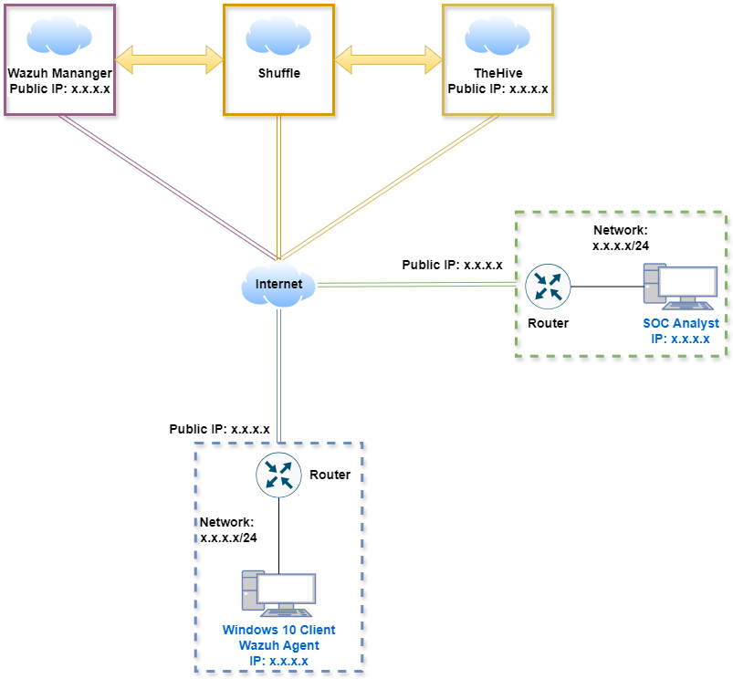

---

## Environment Setup

The lab used a Windows 10 endpoint and cloud-hosted Ubuntu systems for Wazuh and TheHive.

Key setup tasks included:

- Creating a Windows 10 virtual machine
- Installing Sysmon with a custom configuration
- Deploying a Wazuh manager in the cloud
- Installing and configuring TheHive
- Deploying the Wazuh agent to the Windows endpoint
- Configuring Windows event telemetry collection
- Enabling Wazuh archives and Filebeat indexing

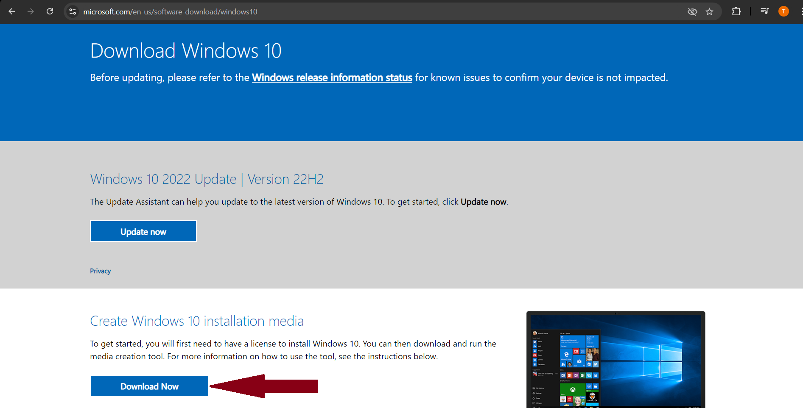

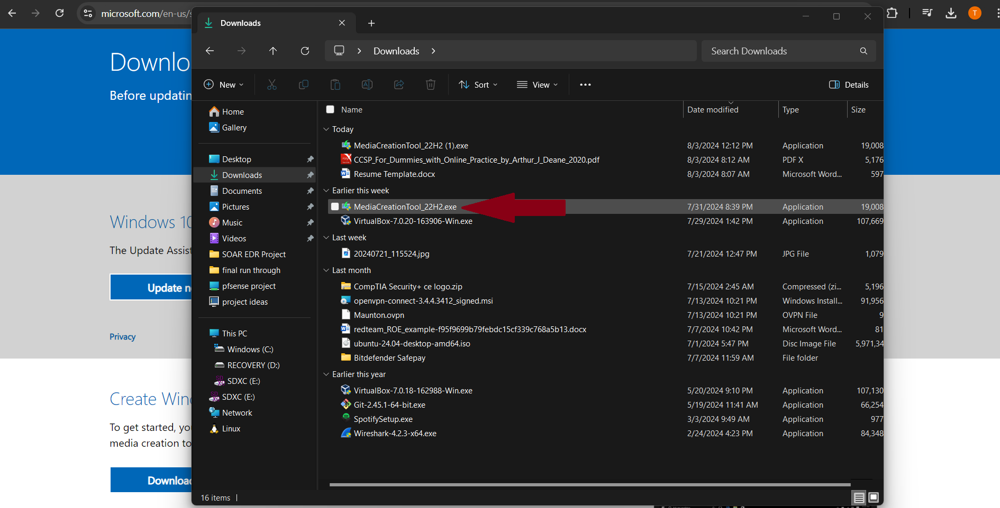

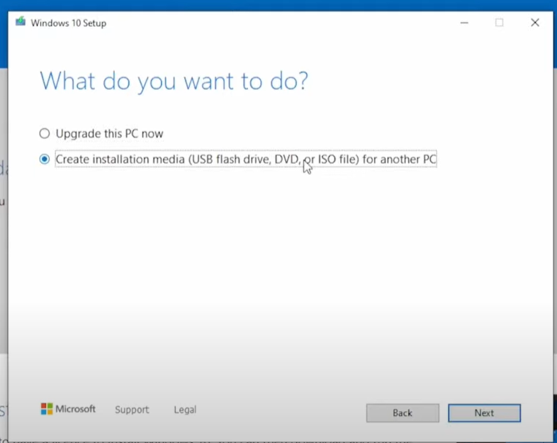

---

## Detection Engineering

A custom Wazuh rule was created to detect suspicious credential-dumping behavior. The detection was tested by running a known credential-access tool in a controlled lab environment and then renaming the executable to confirm that detection logic was not based only on the original filename.

This helped validate:

- Sysmon event collection
- Wazuh log ingestion
- Custom rule creation
- Detection visibility inside the Wazuh dashboard
- Alert forwarding into the automation workflow

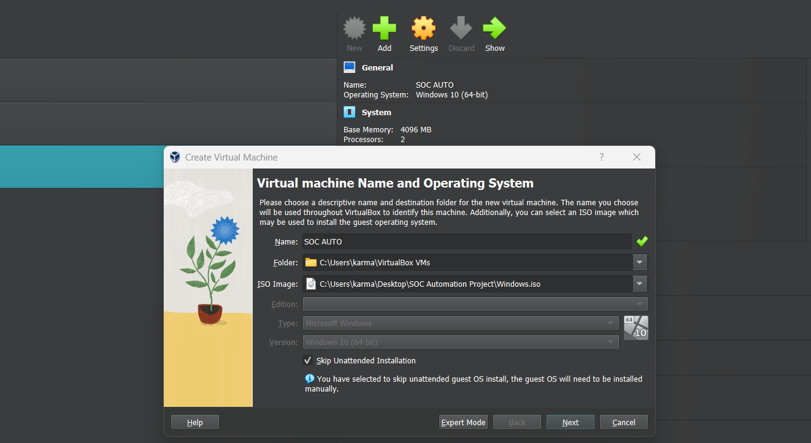

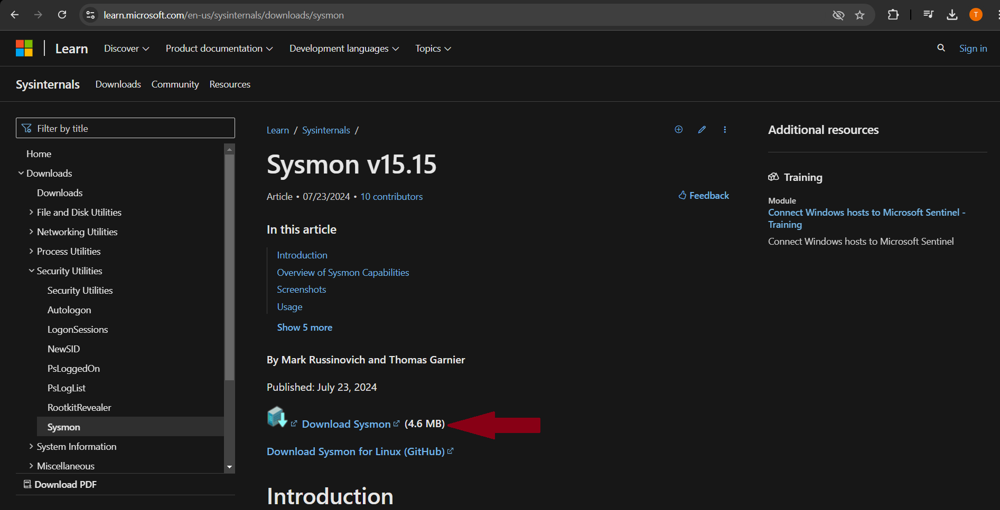

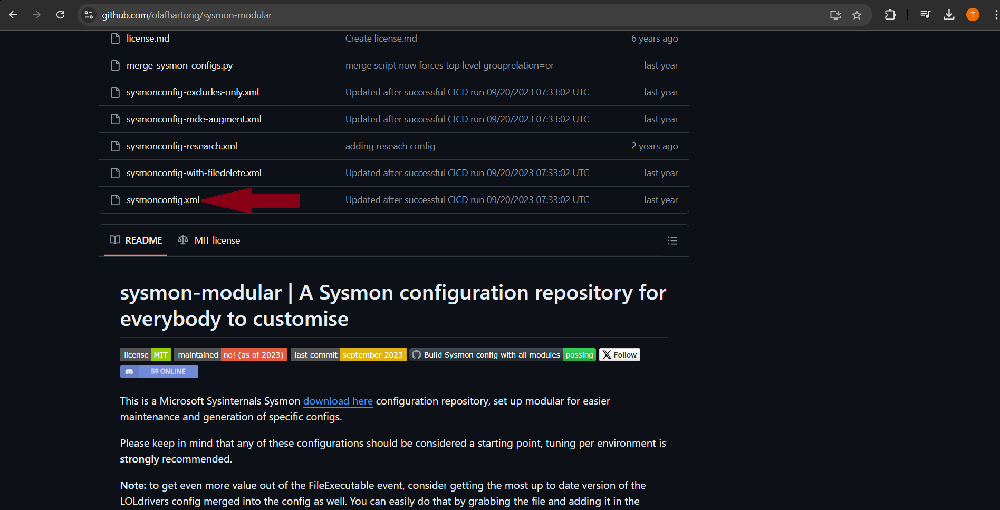

---

## SOAR Automation Workflow

Shuffle was used to automate the alert handling process. Wazuh forwarded alerts to Shuffle through a webhook integration. The workflow parsed the alert data, extracted the SHA256 hash, enriched the hash through VirusTotal, and forwarded the results to TheHive.

Automation steps included:

- Creating a Shuffle webhook trigger
- Connecting Wazuh alerts to Shuffle
- Parsing alert JSON
- Extracting SHA256 hash values
- Sending hash values to VirusTotal
- Creating an alert in TheHive
- Sending an email notification to the SOC team

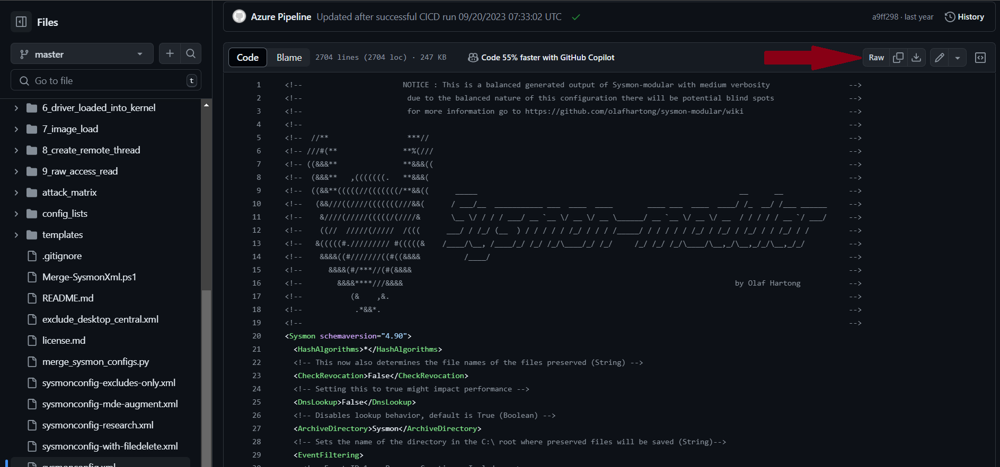

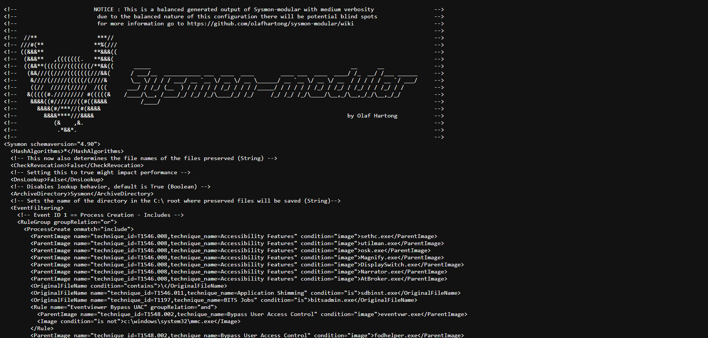

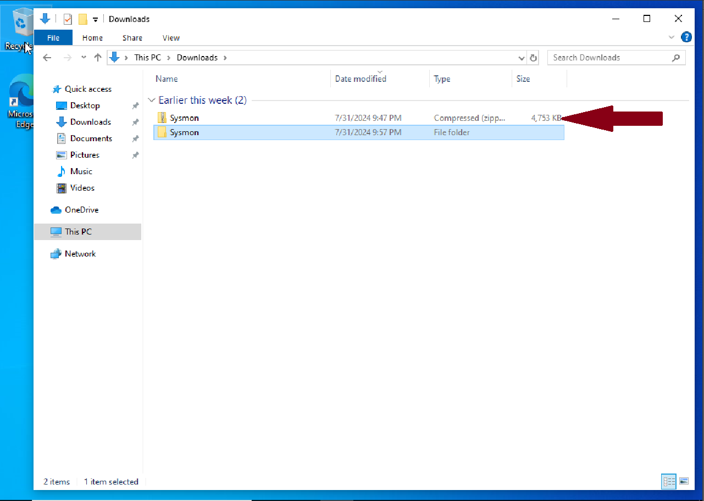

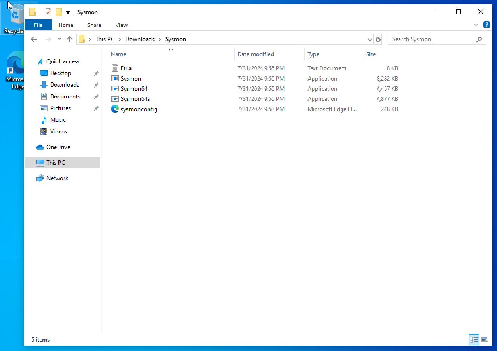

---

## Results and Outcomes

By the end of the project, the lab successfully demonstrated a working SOC alert pipeline:

- Windows endpoint telemetry was collected through Sysmon and Wazuh.
- Suspicious behavior generated searchable events in Wazuh.
- A custom Wazuh rule produced a security alert.
- Shuffle received the alert through a webhook.
- SHA256 indicators were extracted and enriched with VirusTotal.
- TheHive received an alert for analyst case management.
- Email notifications were sent to simulate SOC team alerting.

---

## What Employers Should Notice

This project demonstrates more than tool installation. It shows the ability to design, configure, troubleshoot, and document a security operations workflow from endpoint telemetry through analyst notification.

Key skills demonstrated:

- SOC workflow design
- SIEM deployment and configuration
- SOAR automation logic
- Endpoint telemetry collection
- Detection engineering fundamentals
- Custom alert rule creation
- Threat intelligence enrichment
- Case management integration
- Cloud-hosted security lab setup
- Technical documentation and project ownership

---

## Lessons Learned

This project reinforced the importance of planning the full alert lifecycle before building automations. Each component needed to pass clean data to the next system, which made troubleshooting, field mapping, and workflow validation critical.

Important takeaways:

- Clear architecture diagrams make complex SOC workflows easier to understand.
- Detection logic should be tested against renamed or modified executables when possible.
- Webhook integrations require careful formatting and validation.
- Case management adds structure to incident response workflows.
- Automation should support analysts, not replace investigation.

---

## Future Improvements

Planned improvements for this lab include:

- Add more detection rules mapped to MITRE ATT&CK
- Add YARA or Sigma rule examples
- Include sanitized sample alert JSON
- Add a dedicated architecture diagram
- Add a troubleshooting section
- Add more realistic SOC playbook steps
- Expand the workflow to include Slack or Teams notifications
- Add dashboards for alert volume and workflow status

---

## Disclaimer

This project was built in a controlled lab environment for cybersecurity education, SOC workflow practice, and defensive security skill development. Any offensive security tools or techniques referenced are used only to validate defensive detection and response workflows.
